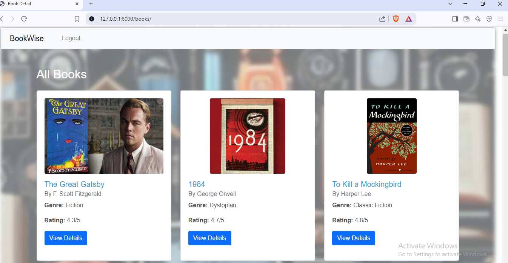
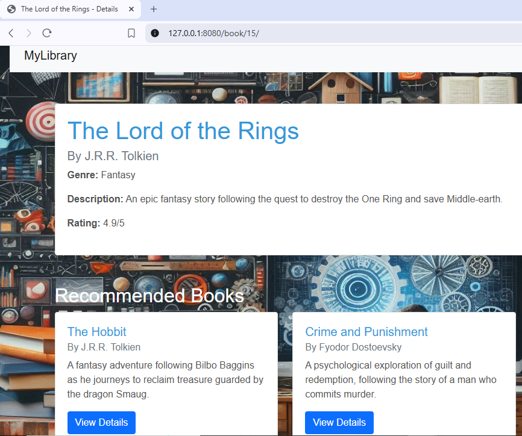

# Book Recommendation System

This is a Django-based Book Recommendation System. Users can view books, see detailed information about each book, 
and get recommendations for similar books based on their descriptions. The frontend is designed using Bootstrap for a clean, responsive UI.

## Features

- **Book Display**: List all books with detailed pages.
- **Book Recommendations**: Content-based recommendation system using `cosine_similarity` from `scikit-learn`.
- **Responsive Design**: Frontend built with Bootstrap for responsiveness.

  
## Technologies Used

- **Backend**: Django
- **Frontend**: Bootstrap, HTML, CSS
- **Database**: SQLite (can be replaced with any relational database)
- **Recommendation Engine**: `scikit-learn` (TF-IDF, cosine similarity)

